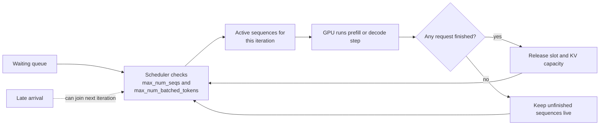

# Continuous batching in vLLM

## 1. The short idea

Continuous batching means the server does **not** wait for a fixed batch to fully finish before admitting new work.
Instead, it rebuilds the active batch every iteration: finished requests leave, unfinished requests stay, and newly arrived requests can join.

A useful mental model is this:

> Static batching is like waiting for a bus to fill, then refusing to pick up anyone else until every passenger reaches the final stop.
> Continuous batching is like a metro line: riders get on and off at every station.

## Concept snapshot

| Lens | Answer |
| --- | --- |
| What | A scheduler policy that rebuilds the active batch every iteration instead of admitting one rigid batch and waiting for it to finish. |
| Why | Mixed prompt lengths and mixed response lengths create idle slots and head-of-line blocking in fixed batches. |
| How | Keep unfinished sequences alive, remove finished ones immediately, and admit new work whenever token and memory budgets allow. |
| Main knobs | `max_num_seqs`, `max_num_batched_tokens`, and the KV-cache capacity that determines how many live sequences can stay active. |
| Common confusion | It changes how requests are scheduled, not the math of the model forward pass itself. |
| What it cannot fix alone | Slow kernels, tiny KV-cache budgets, or a workload that is already perfectly uniform. |

## Where it sits in the serving path

```text
Incoming requests
      |
      v
[waiting queue] -> [scheduler rebuilds active batch every iteration] -> [prefill/decode work] -> [finished requests leave]
                        ^^^^^^^^^^^^^^^^^^^^^^^^^^^^^^^^^^^^^^^^^^^
                        continuous batching happens here
```

## 2. Why this matters

LLM requests almost never have the same shape.
One user may send a 50-token prompt and ask for 20 tokens.
Another may send a 4000-token prompt and ask for 800 tokens.
If you force these into rigid fixed batches, the short request ends up waiting on the long one.

That creates two problems:

1. **Head-of-line blocking** — short jobs are trapped behind long jobs.
2. **Poor GPU occupancy** — parts of the batch go idle as requests finish at different times.

Continuous batching attacks both problems at once.

## 3. Visual explanation

### Static batching

```text
Time --->

Batch 1 admitted at t0:
[A prefill][A d1][A d2][A d3][done]
[B prefill][B d1][done]
[C prefill][C d1][C d2][C d3][C d4][done]

New request D arrives here ----------------------^
But D must wait until the whole batch finishes.
```

### Continuous batching

```text
Time --->

Iteration 1: [A prefill][B prefill]
Iteration 2: [A d1][B d1][C prefill joins]
Iteration 3: [A d2][C d1]     (B finished and leaves)
Iteration 4: [A d3][C d2][D joins]
Iteration 5: [C d3][D d1]     (A finished and leaves)
```

The key difference is that the batch is a **living set of active sequences**, not a one-time group.

### Mermaid view: scheduler rebuild loop



This is the part many readers miss: continuous batching is a loop that keeps re-packing useful work instead of waiting for the slowest request to define the whole batch.

## Static vs continuous batching at a glance

| Question | Static batching | Continuous batching |
| --- | --- | --- |
| When are requests admitted? | Once, when the batch is formed | Repeatedly, at iteration boundaries |
| What happens to a late arrival? | It waits for the whole batch to finish | It can join as soon as a slot and budget are available |
| What happens when short jobs finish early? | Their capacity sits idle until the batch ends | Their capacity is reused almost immediately |
| What limits performance most? | The slowest request in the batch | Scheduler token budget, KV memory, and workload mix |

## 4. How it works step by step

### Step 1: requests enter a waiting queue
Incoming prompts arrive with different lengths and different generation targets.

### Step 2: the scheduler builds an iteration budget
vLLM decides how much work can fit in the current step using limits such as:

- maximum number of sequences
- maximum number of batched tokens
- available KV cache memory

### Step 3: active requests stay in the batch
Requests that still need tokens remain scheduled for the next decode step.

### Step 4: completed requests leave immediately
As soon as a request reaches EOS or its max token limit, it is removed.
That instantly creates room for another request.

### Step 5: new requests can join on the next iteration
This is the “continuous” part. Admission happens repeatedly instead of only once.

## 5. Why it is faster

Continuous batching improves performance mainly by increasing **useful work per unit time**.

```text
Without continuous batching:
GPU time = useful compute + idle gaps + waiting for slowest request

With continuous batching:
GPU time = more useful compute + fewer idle gaps
```

In practice, this usually improves throughput and often helps latency too, especially for short or mixed-size requests.

## 6. Where the KV cache fits in

Continuous batching would be much less useful without a strong KV-cache system.
When requests stay active across many decode steps, the server must keep their past attention state alive efficiently.
That is exactly why vLLM couples continuous batching with paged KV-cache management.

See also: [KV Cache](03_kv_cache.md) and [PagedAttention](04_pagedattention.md).

## 7. vLLM-specific intuition

In vLLM, continuous batching is part of the core serving model rather than an optional “special mode” you usually toggle.
What you usually tune are the scheduler limits around it.

The two most important knobs are:

- `--max-num-seqs`
- `--max-num-batched-tokens`

Think of them this way:

```text
max-num-seqs            = how many active conversations can fit in one iteration
max-num-batched-tokens  = how much token work can fit in one iteration
```

## 8. Minimal vLLM example

### CLI

```bash
vllm serve meta-llama/Llama-3.1-8B-Instruct   --max-num-seqs 64   --max-num-batched-tokens 8192   --gpu-memory-utilization 0.9
```

### Python

```python
from vllm import LLM, SamplingParams

llm = LLM(
    model="meta-llama/Llama-3.1-8B-Instruct",
    max_num_seqs=64,
    max_num_batched_tokens=8192,
    gpu_memory_utilization=0.9,
)

sampling_params = SamplingParams(temperature=0.2, max_tokens=128)
outputs = llm.generate(
    [
        "Explain continuous batching in one paragraph.",
        "Give me a haiku about GPUs.",
        "List three causes of latency spikes in serving.",
    ],
    sampling_params,
)
```

## 9. Worked example

Imagine four requests:

```text
A: short prompt, short answer
B: long prompt, short answer
C: short prompt, long answer
D: arrives late
```

With static batching, D waits until A, B, and C all finish.
With continuous batching:

- A may finish quickly and leave.
- D can take A’s slot almost immediately.
- C can keep decoding without forcing everyone else to pause.

That is why mixed workloads benefit so much.

## 10. When continuous batching helps most

It usually shines when:

- many users are hitting the model at once
- request lengths vary a lot
- the service is decode-heavy
- you care about keeping expensive GPUs busy

It helps less when:

- QPS is very low
- almost every request has the same length and shape
- your bottleneck is somewhere else, such as network or tokenizer throughput

## 11. Trade-offs

Continuous batching is not “free speed.”
It makes scheduling more complex and can expose new bottlenecks:

- KV-cache pressure grows as more requests remain active.
- Very long prefills can still disturb decode latency unless chunked prefill is used.
- Aggressive scheduler limits can trigger preemption or recomputation.

## 12. Practical tuning checklist

Start here:

```text
1. Pick a realistic workload.
2. Increase max-num-seqs until memory or preemption becomes painful.
3. Increase max-num-batched-tokens until throughput stops improving.
4. If long prompts hurt decode latency, enable or tune chunked prefill.
5. Watch TTFT, ITL, throughput, and preemption counts together.
```

## 13. Common mistakes

### Mistake: treating throughput and latency as separate worlds
They are coupled. If you over-pack batches, throughput may rise while inter-token latency gets worse.

### Mistake: tuning only for one prompt length
Continuous batching exists because workloads are mixed. Benchmark a mixed workload, not a toy one.

### Mistake: ignoring memory preemption
If the scheduler keeps admitting work but KV-cache memory is tight, performance can get noisy instead of better.

## 14. One-line summary

Continuous batching keeps the GPU busy by letting requests enter and leave at **iteration boundaries** instead of waiting for a fixed batch to fully finish.

## 15. Visual references

- vLLM Optimization and Tuning: https://docs.vllm.ai/en/stable/configuration/optimization/
- vLLM Engine Arguments (`max_num_seqs`, `max_num_batched_tokens`, scheduler knobs): https://docs.vllm.ai/en/stable/configuration/engine_args/
- vLLM launch blog with the original throughput and memory visuals: https://blog.vllm.ai/2023/06/20/vllm.html

## Source basis
This notebook was written from the official vLLM docs and blog/paper set, including the vLLM docs homepage, Optimization and Tuning, Quantization, Quantized KV Cache, Paged Attention, CUDA Graphs, Attention Backend Feature Support, Batch LLM Inference example, and the original vLLM blog post and paper.
