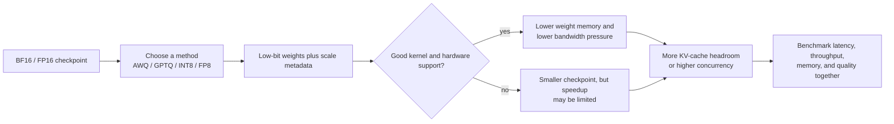

# Quantization in vLLM

## 1. The short idea

Quantization stores model numbers in lower precision so the model uses less memory and often less memory bandwidth.
Lower precision can also unlock faster kernels on supported hardware.

The usual intuition is simple:

```text
Higher precision  -> more memory, more bandwidth, usually better numerical fidelity
Lower precision   -> less memory, less bandwidth, often faster inference
```

## Concept snapshot

| Lens | Answer |
| --- | --- |
| What | Store some tensors in lower precision so the runtime moves fewer bytes and may use faster low-bit kernels. |
| Why | LLM serving is often constrained by memory footprint and bandwidth long before raw FLOPs are the only limit. |
| How | Replace high-precision weights or activations with compressed representations plus scale metadata that optimized kernels can consume. |
| Main knobs | `quantization`, `dtype`, the checkpoint format you load, and whether your hardware/runtime path has good kernel support. |
| Common confusion | Quantization is not automatically a free speedup; a compressed checkpoint still needs strong runtime kernels to pay off. |
| What it cannot fix alone | Bad scheduling, poor KV-cache sizing, or an unsupported hardware/software path. |

## Where it sits in the serving path

```text
Model checkpoint -> quantized weight format -> runtime loads low-bit tensors -> optimized kernel reads/dequantizes as needed -> layer output
                                            |
                                            +-> less weight memory can leave more room for KV cache and concurrency
```

## 2. What exactly gets quantized?

In practice, several things can be quantized:

- model weights
- activations
- KV cache

This notebook focuses first on **weight/activation quantization**.
KV-cache quantization is related, but because it behaves differently during serving, it is covered separately in [KV Cache](03_kv_cache.md).

## 3. Visual explanation

```text
Original weights (BF16 / FP16)
[ 0.183, -1.246, 0.992, 0.014, ... ]

Quantized weights (INT4 / INT8 / FP8)
[  9,    -6,      7,     0,   ... ] + scale metadata

Runtime idea:
low-bit values + scale(s) -> approximate original values inside optimized kernels
```

The model is still doing “the same job,” but with a more compressed representation.

### Mermaid view: where quantization helps and where it can disappoint



The diagram is a good serving mental model: compression by itself saves memory, but real speedups come only when the runtime can execute that format efficiently on your hardware.

## 4. Why quantization can speed up inference

There are two major wins.

### Win 1: smaller memory footprint
A smaller model fits into less VRAM.
That can be the difference between:

- not fitting at all
- fitting with room left for a larger KV cache
- fitting enough replicas to increase concurrency

### Win 2: lower bandwidth pressure
Inference is often limited by memory movement, not only by raw compute.
When the model reads fewer bytes per layer, kernels can finish faster.

## 5. Why it is not always a win

Quantization introduces approximation.
That means you are always balancing three things:

```text
quality  <->  latency  <->  memory use
```

Sometimes a quantized model is clearly better.
Sometimes an unquantized BF16 model still wins for throughput or accuracy.
The only safe rule is: benchmark on your own workload.

## 6. vLLM support at a glance

vLLM supports a wide range of quantization methods and hardware-specific paths.
You should think of vLLM as a serving engine that can load many different quantized checkpoints rather than as a single quantization algorithm.

A practical way to think about the choices is:

```text
AWQ / GPTQ / GGUF / INT4 / INT8 / FP8 / compressed-tensors / TorchAO / ModelOpt / more
```

Different methods trade off quality, compatibility, and kernel availability.

## 7. Mental model for the common methods

### AWQ
Protects the most important weights using calibration-aware scaling.
Often attractive for memory reduction with good quality retention.

### GPTQ
Post-training quantization that tries to preserve model behavior layer by layer.
Common for pre-quantized community checkpoints.

### INT8 / FP8
Often used where hardware and kernels are built to exploit them well.
These can be strong options on recent accelerators.

### GGUF
Common in local inference ecosystems and CPU/GPU hybrid use cases, depending on setup.

## Serving-oriented method guide

| Method family | Why teams try it | What to validate first |
| --- | --- | --- |
| AWQ | Strong weight-only compression with good quality retention on many popular checkpoints | Real throughput on your hardware, not just memory savings |
| GPTQ | Large ecosystem of pre-quantized community checkpoints | Model compatibility and output quality on your own prompts |
| INT8 / FP8 | Often aligns well with newer accelerator support and runtime kernels | Device support, dtype compatibility, and actual kernel path used |
| GGUF | Useful when deployment looks more like local or hybrid inference than standard datacenter serving | Whether your vLLM workflow and target hardware actually match that serving style |

## 8. Minimal vLLM example with AWQ

### CLI

```bash
vllm serve TheBloke/Llama-2-7b-Chat-AWQ   --quantization awq   --dtype half
```

### Python

```python
from vllm import LLM, SamplingParams

llm = LLM(
    model="TheBloke/Llama-2-7b-Chat-AWQ",
    quantization="awq",
    dtype="half",
)

sampling_params = SamplingParams(temperature=0.7, top_p=0.9, max_tokens=128)
outputs = llm.generate(["Why does quantization help serving?"], sampling_params)
print(outputs[0].outputs[0].text)
```

## 9. Example: what changes operationally

Suppose you have a model that barely fits in BF16.
In BF16 you may have:

```text
Weights: very large
KV cache headroom: small
Concurrent requests: limited
```

After moving to a good 4-bit or 8-bit serving path, you may get:

```text
Weights: much smaller
KV cache headroom: larger
Concurrent requests: higher
Potential speedup: yes, if kernels and workload align
```

That is why quantization often improves not just “single request speed,” but the whole serving envelope.

## 10. Creating quantized checkpoints vs serving them

These are different steps.

### Creating the checkpoint
You quantize the original model and save the low-bit weights.

### Serving the checkpoint
vLLM loads those weights and uses compatible low-bit kernels.

This distinction matters because a great quantizer with weak runtime kernels can still disappoint in production.

## 11. A practical workflow

```text
1. Start with a known pre-quantized checkpoint that vLLM supports well.
2. Verify correctness and output quality on your prompts.
3. Compare against BF16/FP16 on TTFT, ITL, throughput, and memory.
4. Only then decide whether to quantize your own model.
```

## 12. When quantization helps most

It is especially useful when:

- the model barely fits in memory
- you want more concurrent requests per GPU
- your workload is bandwidth-bound
- the hardware has good low-bit kernel support

## 13. When to be careful

Be more cautious when:

- the application is highly accuracy-sensitive
- you rely on exact logit behavior
- the quantized checkpoint uses a method with weaker kernel support on your hardware
- your baseline is already compute-saturated and low-bit kernels do not help much

## 14. Practical tuning checklist

### First pass

```text
- Pick one BF16/FP16 baseline.
- Pick one quantized candidate.
- Keep max_num_seqs, max_num_batched_tokens, and prompts identical.
- Measure memory, throughput, TTFT, and output quality side by side.
```

### If quality drops too much

Try one of these:

- a better quantization method
- fewer aggressive bits
- a different checkpoint family
- keeping the KV cache or some layers in higher precision

## 15. Common mistakes

### Mistake: assuming every quantized model is faster
Some are smaller but not faster on your hardware.
The serving kernels matter as much as the checkpoint format.

### Mistake: mixing too many changes at once
If you change model, dtype, scheduler, and batching together, you will not know what helped.

### Mistake: forgetting the cache budget
A smaller weight footprint often helps because it frees more VRAM for the KV cache, not only because matmuls become cheaper.

## 16. Extra note on current vLLM guidance

For creating new AWQ-style quantized checkpoints, current vLLM docs point to **llm-compressor** as the recommended workflow, while older AutoAWQ-based flows are marked as deprecated.

## 17. One-line summary

Quantization improves serving by shrinking the numerical representation of model data, which reduces memory pressure and can unlock faster low-bit kernels when the hardware and runtime path are a good match.

## 18. Visual references

- vLLM quantization overview: https://docs.vllm.ai/en/stable/features/quantization/
- vLLM supported hardware matrix for quantization kernels: https://docs.vllm.ai/en/stable/features/quantization/supported_hardware.html
- LLM Compressor AWQ example for creating vLLM-friendly checkpoints: https://docs.vllm.ai/projects/llm-compressor/en/stable/examples/awq/

## Source basis
This notebook was written from the official vLLM docs and blog/paper set, including the vLLM docs homepage, Optimization and Tuning, Quantization, Quantized KV Cache, Paged Attention, CUDA Graphs, Attention Backend Feature Support, Batch LLM Inference example, and the original vLLM blog post and paper.
