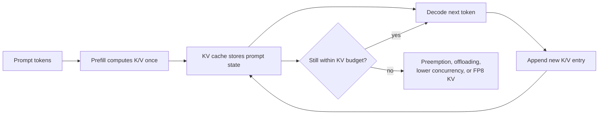

# KV cache in vLLM

## 1. The short idea

The KV cache stores the **keys** and **values** produced by attention for tokens that have already been processed.
Instead of recomputing those tensors on every next-token step, the model reuses them.

This is why autoregressive decoding is practical at all.

## Concept snapshot

| Lens | Answer |
| --- | --- |
| What | A memory store for the past attention keys and values so decode steps can reuse prior work instead of recomputing the whole prefix. |
| Why | Without it, every new token would repeatedly rebuild past attention state, making generation far too expensive. |
| How | Prefill computes K/V tensors once, decode reads them back for every next-token step, and each new token appends its own K/V entry. |
| Main knobs | `gpu_memory_utilization`, `kv_cache_memory_bytes`, `kv_cache_dtype`, `kv_offloading_size`, plus your context length and concurrency targets. |
| Common confusion | Weight memory and KV-cache memory are different budgets; shrinking model weights does not remove KV pressure by itself. |
| What it cannot fix alone | Fragmentation, poor scheduler policy, or kernels that are slow for your dtype/backend combination. |

## Where it sits in the serving path

```text
Prompt tokens -> [prefill computes K/V once] -> [KV cache stores past state] -> [decode reads cache + appends new K/V] -> next token
                                           ^^^^^^^^^^^^^^^^^^^^^^^^^^^^^^^
                                           this notebook is about that live memory state
```

## 2. Why the KV cache exists

During generation, the model predicts one token at a time.
At step `t`, the next token must attend to all earlier tokens.
Without a cache, the server would repeatedly recompute the past attention state for the full prefix.
That would be extremely wasteful.

### Without a KV cache

```text
Step 1: compute token 1 state
Step 2: recompute tokens 1-2 state
Step 3: recompute tokens 1-3 state
Step 4: recompute tokens 1-4 state
...
```

### With a KV cache

```text
Prefill: compute tokens 1..N once and store their K/V tensors
Decode step N+1: compute only the new token, attend to cached past
Decode step N+2: compute only the new token, attend to cached past
...
```

That is the win.

## 3. Visual explanation

```text
Prompt tokens:   [t1][t2][t3][t4]
                  |   |   |   |
                  v   v   v   v
KV cache:        [KV1][KV2][KV3][KV4]

Generate token t5:
- compute KV5 once
- attention reads KV1..KV5
- store KV5 for future steps

Generate token t6:
- compute KV6 once
- attention reads KV1..KV6
- store KV6 for future steps
```

The cache grows as generation continues.

### Mermaid view: prefill once, reuse many times



This is why the KV cache feels like both a speed feature and a capacity limit: decode keeps getting cheaper, but the live memory state keeps growing while requests stay active.

## 4. Why KV cache is both a speedup and a bottleneck

### It is a speedup because:
- it avoids recomputation of past-token attention state
- it makes decode steps much cheaper than full re-prefill

### It is a bottleneck because:
- it consumes a lot of memory
- it grows with sequence length and concurrency
- it is often the real thing limiting batch size

A practical rule:

```text
More active sequences or longer contexts -> more KV memory pressure
```

## 5. Prefill vs decode

### Prefill phase
The server processes the prompt and creates the initial KV entries.
This is usually compute-heavier.

### Decode phase
The server generates one or a few new tokens and appends their KV entries.
This is usually more memory-sensitive and repeated many times.

That difference is why vLLM features like chunked prefill and speculative decoding exist.

## 6. Rough scaling intuition

KV-cache memory tends to scale roughly with:

```text
number of active tokens
x number of layers
x number of KV heads
x head dimension
x bytes per value
```

So if you double context length or concurrent active requests, the KV cache can become the dominant memory consumer very quickly.

## What usually changes cache pressure fastest

| Change | What happens to the KV cache | What you usually notice operationally |
| --- | --- | --- |
| Longer prompts or larger `max_model_len` | More tokens stay alive per request | Concurrency drops sooner than expected |
| More active sequences | More caches grow in parallel | Preemption risk and latency variance increase |
| Lower KV dtype such as FP8 | Fewer bytes per cached value | More headroom, with hardware/quality caveats |
| CPU KV offloading | Effective capacity rises beyond GPU-only memory | Capacity improves, but latency overhead can rise |

## 7. vLLM knobs that matter most

### `gpu_memory_utilization`
This tells vLLM what fraction of GPU memory it can use for the model executor.
In current docs, the default is `0.9`.

### `kv_cache_memory_bytes`
Lets you explicitly size the KV cache instead of only relying on the utilization fraction.

### `kv_cache_dtype`
Controls the KV-cache storage dtype.
On supported platforms, FP8 variants can reduce the cache footprint significantly.

### `kv_offloading_size`
Lets vLLM offload part of the KV cache to CPU memory.
That increases effective capacity but adds overhead.

## 8. Minimal vLLM examples

### CLI: give the executor more room for cache

```bash
vllm serve meta-llama/Llama-3.1-8B-Instruct   --gpu-memory-utilization 0.92   --max-model-len 32768   --max-num-seqs 32
```

### CLI: use FP8 KV cache when supported

```bash
vllm serve meta-llama/Llama-3.1-8B-Instruct   --kv-cache-dtype fp8_e4m3   --gpu-memory-utilization 0.92
```

### Python

```python
from vllm import LLM, SamplingParams

llm = LLM(
    model="meta-llama/Llama-3.1-8B-Instruct",
    gpu_memory_utilization=0.92,
    max_model_len=32768,
    max_num_seqs=32,
)

sampling_params = SamplingParams(max_tokens=256, temperature=0)
out = llm.generate(["Explain why the KV cache matters."], sampling_params)
print(out[0].outputs[0].text)
```

## 9. Example: why requests get preempted

Imagine a GPU with enough room for the model plus a certain KV-cache budget.
Now suppose you admit many long requests at once.
The total live KV footprint grows until it can no longer fit comfortably.

At that point the engine may need to:

- preempt work
- recompute work later
- reduce effective concurrency

This is why the KV cache is often the hidden reason a server “looks busy” but performs inconsistently.

## 10. The relationship to concurrency

```text
More concurrency -> more live sequences -> more KV cache usage
Longer prompts   -> more prefill tokens -> more initial KV usage
Longer outputs   -> more decode steps   -> larger growing KV cache
```

If you want higher concurrency, you almost always end up thinking about KV-cache headroom.

## 11. Quantized KV cache vs regular KV cache

Regular KV cache usually uses the model dtype or an automatic default.
Quantized KV cache uses lower precision, often FP8, to reduce the cache footprint.

This is especially useful when:

- weights already fit comfortably
- the KV cache is now the dominant memory cost
- long context or high concurrency is the main pressure point

## 12. Practical tuning checklist

### Start here

```text
1. Watch for preemptions and unstable latency.
2. Increase gpu_memory_utilization if you still have safe headroom.
3. Reduce max_num_seqs or max_num_batched_tokens if pressure is too high.
4. Consider fp8 KV cache if supported.
5. Consider more tensor parallelism if weights are the memory hog.
6. Use KV offloading only when the extra capacity is worth the latency trade-off.
```

## 13. Common mistakes

### Mistake: assuming the model weights are the only memory problem
In long-context serving, KV cache often dominates.

### Mistake: pushing concurrency up without watching the cache
A higher `max_num_seqs` may look attractive but can backfire if the cache becomes unstable.

### Mistake: increasing max model length without adjusting anything else
Longer context windows raise the possible KV footprint dramatically.

## 14. One-line summary

The KV cache is the memory structure that makes fast autoregressive decoding possible by reusing past attention state, but it is also one of the main limits on context length and concurrency.

## 15. Visual references

- vLLM Engine Arguments (`gpu_memory_utilization`, `kv_cache_memory_bytes`, `kv_cache_dtype`, `kv_offloading_size`): https://docs.vllm.ai/en/stable/configuration/engine_args/
- vLLM Quantized KV Cache guide: https://docs.vllm.ai/en/stable/features/quantization/quantized_kvcache.html
- vLLM blog on the KV offloading connector and CPU offloading flow: https://blog.vllm.ai/2026/01/08/kv-offloading-connector.html

## Source basis
This notebook was written from the official vLLM docs and blog/paper set, including the vLLM docs homepage, Optimization and Tuning, Quantization, Quantized KV Cache, Paged Attention, CUDA Graphs, Attention Backend Feature Support, Batch LLM Inference example, and the original vLLM blog post and paper.
