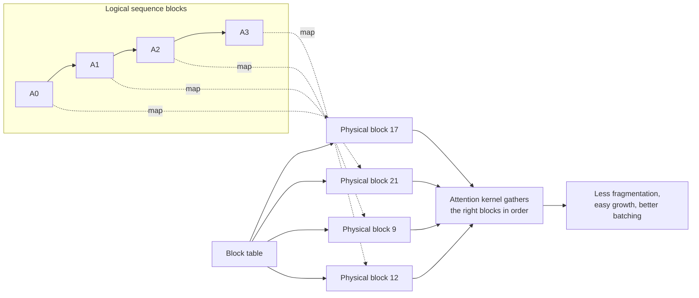
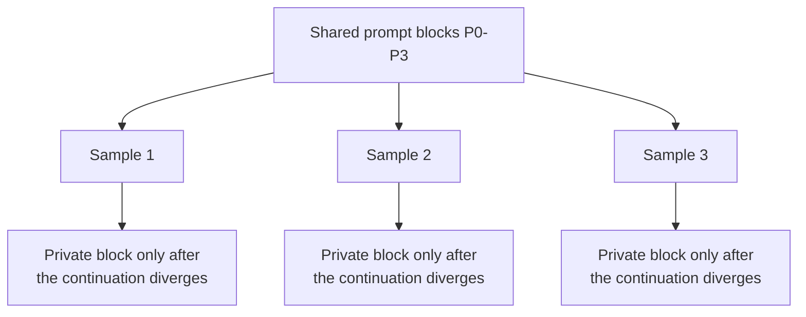

# PagedAttention in vLLM

## 1. The short idea

PagedAttention is the memory-management idea that lets vLLM store a sequence’s KV cache in **fixed-size blocks** that do **not** need to be contiguous in physical memory.

It borrows the intuition of operating-system paging.

```text
Logical sequence order  !=  physical memory contiguity
```

That sounds small, but it changes serving performance dramatically.

## Concept snapshot

| Lens | Answer |
| --- | --- |
| What | A paged KV-memory layout where a sequence is stored as logical blocks that can live in non-contiguous physical memory. |
| Why | Growing sequences, uneven request lengths, and prefix sharing make contiguous KV allocation wasteful and fragile. |
| How | Maintain block tables that map each sequence’s logical token order to fixed-size physical KV blocks. |
| Main knobs | Most users get it automatically in vLLM; the user-facing tuning surface is the adjacent KV-cache size, dtype, and scheduling settings. |
| Common confusion | PagedAttention is mostly about KV-memory management plus a compatible attention access pattern, not a brand-new attention formula. |
| What it cannot fix alone | A cache that is too small overall, unsupported backends, or poor workload-level tuning. |

## Where it sits in the serving path

```text
Prompt/decode tokens -> KV cache grows -> block table maps logical order to physical blocks -> attention kernel gathers blocks -> output
                                        ^^^^^^^^^^^^^^^^^^^^^^^^^^^^^^^^^^^^^^^^^^^^^^^^
                                        PagedAttention keeps this memory layout flexible
```

## 2. The problem it solves

A sequence’s KV cache grows token by token.
If you try to store each sequence in one big contiguous region, two bad things happen:

- you over-reserve memory “just in case”
- you create fragmentation as requests grow and finish unevenly

That wastes GPU memory.
And if memory is wasted, batch size and throughput suffer.

## 3. Visual explanation

### Traditional contiguous allocation idea

```text
Sequence A wants 10 blocks: [AAAAAAAAAA]
Sequence B wants  3 blocks: [BBB]
Sequence C wants  7 blocks: [CCCCCCC]

As requests grow/shrink, free space becomes scattered.
Finding large contiguous regions becomes painful.
```

### PagedAttention idea

```text
Logical blocks for Sequence A:  A0 A1 A2 A3
Logical blocks for Sequence B:  B0 B1

Physical GPU blocks:
[ 17 ][  4 ][ 21 ][  9 ][ 33 ][ 12 ]
   |     |     |     |     |     |
   A0    B0    A1    A2    B1    A3

Block table for A: A0->17, A1->21, A2->9, A3->12
Block table for B: B0->4,  B1->33
```

The sequence stays logically ordered even though its physical storage is scattered.

### Mermaid view: logical order mapped onto physical blocks



### Mermaid view: shared prefixes and copy-on-write



These two views together show the full idea: paging keeps memory flexible for one sequence, and block sharing keeps repeated prefixes cheap across many related sequences.

## 4. Why that helps

### Benefit 1: near-zero waste except the tail block
Memory waste is largely limited to the unused portion of the last block of a sequence.

### Benefit 2: easy growth
When a sequence needs more space, vLLM allocates another block instead of searching for a huge contiguous region.

### Benefit 3: better batching
Because memory waste is low, more requests fit at once.
That boosts continuous batching and GPU utilization.

### Benefit 4: efficient sharing
Multiple sequences can share blocks for common prefixes.
This matters for techniques like parallel sampling and beam search.

## Contiguous vs paged mental model

| Lens | Contiguous allocation | Paged allocation |
| --- | --- | --- |
| Allocation unit | One large growing region per sequence | Small fixed-size blocks |
| Growth behavior | Harder to extend cleanly | Add another block when needed |
| Waste pattern | Reserved tail space and fragmentation accumulate | Waste is mostly limited to the last block |
| Prefix sharing | Awkward and expensive | Natural with block references and copy-on-write |
| Scheduler impact | Memory becomes brittle under mixed workloads | More requests can stay active safely |

## 5. Copy-on-write intuition

Imagine four samples generated from the same prompt.
Their prompt KV cache is initially identical.
With block-level sharing:

```text
Shared prompt blocks:
P0 P1 P2 P3

Sample 1 continuation: S1a S1b ...
Sample 2 continuation: S2a S2b ...
Sample 3 continuation: S3a S3b ...
Sample 4 continuation: S4a S4b ...
```

All four samples can reference the same prompt blocks.
Only when a block must diverge does the system need a private copy.
That is the copy-on-write intuition.

## 6. How the attention kernel sees it

The kernel does not just walk one flat contiguous tensor per sequence.
Instead, it uses metadata such as a block table to locate the right K/V pages in physical memory.

A simplified picture:

```text
Query q_t
  -> read block table for this sequence
  -> gather the relevant K/V blocks
  -> compute attention over the logical token order
```

So PagedAttention is both:

- a memory-allocation strategy
- an attention-access pattern compatible with that allocation strategy

## 7. Important current nuance

The current vLLM docs note that the published PagedAttention write-up is a **historical** explanation tied to the original paper, while the current codebase uses its own attention kernel designed for paged KV caches.

That means the old document is still excellent for intuition, even if the implementation details have evolved.

## 8. Why this matters for performance

PagedAttention is not a random internal detail.
It directly enables:

- larger effective batch sizes
- lower memory waste
- safer dynamic request growth
- better compatibility with continuous batching
- efficient prefix and sampling-related sharing

In other words, it turns memory from a brittle constraint into something the scheduler can work with much more efficiently.

## 9. Example: why contiguous memory would waste space

Suppose requests stop at different lengths.
If each one had a large contiguous reservation, a lot of the reserved tail space would remain unused.

With block paging:

```text
Request A length = 34 tokens
Request B length = 65 tokens
Block size       = 16 tokens

A uses 3 full blocks + 1 tail block
B uses 4 full blocks + 1 tail block
```

Waste is now mostly limited to the unused portion of the last block of each request, not to a huge over-reserved region.

## 10. What you configure in vLLM

Most users do **not** enable PagedAttention with a special flag.
It is part of what you get by using vLLM.

What you typically tune instead are adjacent concerns:

- KV-cache size and dtype
- batching limits
- chunked prefill
- attention backend selection

## 11. Minimal example: benefiting from shared prefixes

```python
from vllm import LLM, SamplingParams

llm = LLM(model="meta-llama/Llama-3.1-8B-Instruct")

sampling_params = SamplingParams(
    temperature=0.8,
    top_p=0.95,
    n=4,  # generate 4 samples from the same prompt
    max_tokens=64,
)

outputs = llm.generate(
    ["Write four different opening lines for a cyberpunk story."],
    sampling_params,
)
```

The important idea is not the code itself.
It is that multiple continuations from one prompt are exactly the kind of situation where shared prefix blocks become valuable.

## 12. Practical tuning checklist

You usually do not tune “PagedAttention” directly.
Instead, ask:

```text
- Is my KV cache the memory bottleneck?
- Are long prompts or many active sequences causing pressure?
- Am I leaving performance on the table because batching is too conservative?
- Would prefix sharing, parallel sampling, or beam search benefit from better memory sharing?
```

If the answer is yes, PagedAttention is already the internal mechanism doing the heavy lifting for you.

## 13. Common mistakes

### Mistake: thinking PagedAttention is only an attention trick
It is really a co-design of attention access and KV-memory management.

### Mistake: assuming contiguous memory is always better
For dynamic serving workloads, contiguous allocation is often exactly what causes waste and fragmentation.

### Mistake: treating PagedAttention and continuous batching as unrelated
They reinforce each other. Better memory efficiency allows the scheduler to keep more useful work active.

## 14. One-line summary

PagedAttention makes vLLM’s KV cache behave more like paged virtual memory, which sharply reduces fragmentation and waste while enabling larger, more flexible dynamic batches.

## 15. Visual references

- vLLM design note for Paged Attention: https://docs.vllm.ai/en/stable/design/paged_attention/
- vLLM launch blog with the original paging and copy-on-write figures: https://blog.vllm.ai/2023/06/20/vllm.html
- vLLM paper on arXiv: https://arxiv.org/abs/2309.06180

## Source basis
This notebook was written from the official vLLM docs and blog/paper set, including the vLLM docs homepage, Optimization and Tuning, Quantization, Quantized KV Cache, Paged Attention, CUDA Graphs, Attention Backend Feature Support, Batch LLM Inference example, and the original vLLM blog post and paper.
