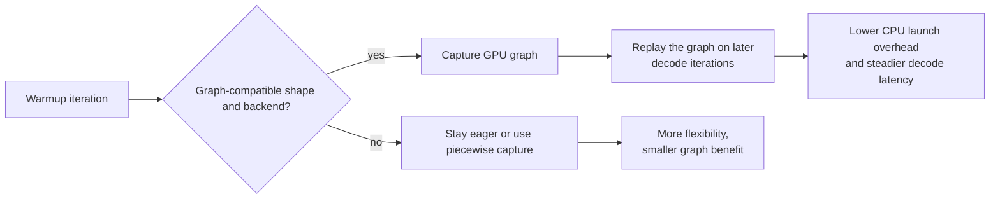

# CUDA/HIP graphs in vLLM

## 1. The short idea

CUDA/HIP graphs reduce CPU launch overhead by **capturing** a stable GPU execution pattern once and then **replaying** it many times.

That matters because modern serving workloads often repeat similar decode shapes over and over.

## Concept snapshot

| Lens | Answer |
| --- | --- |
| What | A way to record a stable GPU execution sequence once and replay it later with much lower CPU launch overhead. |
| Why | Decode-heavy serving can spend noticeable time repeatedly launching many small kernels from the CPU side. |
| How | Warm up a compatible path, capture the graph-friendly work, then replay the captured graph for future iterations with similar shapes. |
| Main knobs | `compilation_config`, `cudagraph_mode`, backend graph support, warmup/capture behavior, and workload shape stability. |
| Common confusion | Graphs mostly reduce orchestration overhead around execution; they do not magically make each kernel's math faster. |
| What it cannot fix alone | Memory bottlenecks, unsupported attention backends, or workloads whose shapes change too much to reuse captures well. |

## Where it sits in the serving path

```text
Warmup iteration -> capture graph-friendly forward path -> repeated decode steps replay graph -> lower CPU launch overhead
                   ^^^^^^^^^^^^^^^^^^^^^^^^^^^^^^^^^^^
                   CUDA/HIP graphs act on this repeated execution pattern
```

## 2. Why kernel launch overhead matters

Even when GPU kernels are fast, the CPU still has to launch them.
If your serving loop runs many small kernels per token, launch overhead can become noticeable.

This is especially true when:

- the model is relatively small
- you care about very low latency
- decode steps are short and frequent

## 3. Visual explanation

### Eager execution

```text
Every iteration:
CPU launches kernel A
CPU launches kernel B
CPU launches kernel C
CPU launches kernel D
GPU executes them

Repeat again...
```

### Graph execution

```text
Warmup/capture once:
[A -> B -> C -> D]  recorded as one replayable graph

Later iterations:
CPU says "replay graph"
GPU runs the recorded sequence
```

The more often the same execution pattern repeats, the more launch overhead you can amortize.

### Mermaid view: capture once, replay when shapes stay stable



This is the main trade-off in one picture: the more repeatable the execution path is, the easier it is to trade a one-time capture cost for cheaper repeated launches later.

## 4. Why shape stability matters

A graph is easiest to reuse when the execution structure is stable.
If every batch shape changes wildly, capture/replay becomes harder or less useful.

That is why graph-based execution often fits decode-heavy serving better than arbitrary mixed-shape workloads.

## 5. The vLLM view

vLLM’s current CUDA-graphs design separates graph behavior from compilation more cleanly than older approaches.
It can choose between different graph modes depending on workload shape and backend support.

## 6. The important graph modes

Think of the modes like this:

### `NONE`
No graph capture. Useful for debugging.

### `PIECEWISE`
Capture only the parts that are graph-friendly; keep unsupported operations eager.
Good compatibility, moderate benefits.

### `FULL`
Capture the whole forward path where supported.
Potentially lower latency, but stricter compatibility.

### `FULL_DECODE_ONLY`
Use full graphs for uniform decode batches, not for prefill/mixed batches.
Good when decode performance matters most.

### `FULL_AND_PIECEWISE`
Use full graphs when possible and piecewise graphs otherwise.
This is the most ambitious mode and is the default mode described by the design doc.

## Graph modes at a glance

| Mode | Best mental model | Typical reason to use it |
| --- | --- | --- |
| `NONE` | Stay fully eager | Debugging, bring-up, or incompatible paths |
| `PIECEWISE` | Capture the safe graph-friendly islands only | Good compatibility when some ops must remain eager |
| `FULL_DECODE_ONLY` | Fully graph repeated decode batches | Decode-heavy services where decode latency matters most |
| `FULL` | Capture the whole compatible forward path | Controlled workloads with stable shapes |
| `FULL_AND_PIECEWISE` | Prefer full capture, fall back to piecewise when needed | Strong default when you want broad speedups without assuming every path is fully graphable |

## 7. Visual intuition for piecewise vs full

```text
Model forward pass:
[embed] -> [attention] -> [mlp] -> [sampler]

PIECEWISE:
[embed + mlp] graph-captured
[attention]   stays eager if backend limits require it

FULL:
[embed + attention + mlp + sampler] captured as one graph
```

Piecewise is more flexible.
Full can be faster when everything is compatible.

## 8. Minimal vLLM example

### CLI

```bash
vllm serve meta-llama/Llama-3.1-8B-Instruct   --compilation-config '{"cudagraph_mode": "FULL_AND_PIECEWISE"}'
```

### Python

```python
from vllm import LLM, SamplingParams

compilation_config = {"mode": 3, "cudagraph_mode": "FULL_AND_PIECEWISE"}

llm = LLM(
    model="meta-llama/Llama-3.1-8B-Instruct",
    compilation_config=compilation_config,
)

sampling_params = SamplingParams(temperature=0, max_tokens=128)
outputs = llm.generate(["Explain CUDA graphs in one paragraph."], sampling_params)
print(outputs[0].outputs[0].text)
```

## 9. Where the speedup comes from

Graph capture usually helps in three ways:

1. fewer CPU-side launches
2. more predictable execution
3. less runtime overhead around repeated decode steps

It does **not** magically make every kernel numerically faster.
It mainly makes execution orchestration cheaper.

## 10. When it helps most

CUDA/HIP graphs often help most when:

- the workload is decode-heavy
- batch shapes are repetitive enough
- the attention backend supports graph capture well
- you care about low per-token latency

## 11. When it helps less

It may help less when:

- prompts are extremely diverse and highly irregular
- the backend lacks full graph support
- the workload is dominated by long prefills rather than repeated decode
- memory overhead from capture is too costly

## 12. Graph compatibility and attention backends

Not every attention backend supports the same degree of graph capture.
That is why vLLM’s design includes runtime dispatch and compatibility checks.
A backend may support:

- no graphs
- graphs only for decode-like uniform batches
- graphs for a wider set of batches

So graph tuning and attention-backend tuning are related.
See [Optimized CUDA kernels](06_optimized_cuda_kernels.md).

## 13. Practical tuning checklist

```text
1. Start with the default graph strategy.
2. Benchmark TTFT and ITL before changing modes.
3. If decode latency is the main issue, compare FULL_DECODE_ONLY vs FULL_AND_PIECEWISE.
4. If debugging weird behavior, switch to NONE first.
5. Always compare on the same prompt mix and concurrency.
```

## 14. Common mistakes

### Mistake: expecting graphs to fix a memory bottleneck
Graphs reduce launch overhead. They do not eliminate KV-cache pressure.

### Mistake: enabling the most aggressive mode without benchmarking
The best mode depends on workload shape and backend support.

### Mistake: ignoring warmup/capture cost
Some modes need more capture work and memory upfront.
That may matter for short-lived jobs.

## 15. One-line summary

CUDA/HIP graphs speed up repeated serving paths by recording stable GPU execution and replaying it with less CPU launch overhead, especially for decode-heavy low-latency workloads.

## 16. Visual references

- vLLM CUDA Graphs design note: https://docs.vllm.ai/en/stable/design/cuda_graphs/
- vLLM Attention Backend Feature Support: https://docs.vllm.ai/en/stable/design/attention_backends/
- vLLM launch blog for the broader serving-stack view: https://blog.vllm.ai/2023/06/20/vllm.html

## Source basis
This notebook was written from the official vLLM docs and blog/paper set, including the vLLM docs homepage, Optimization and Tuning, Quantization, Quantized KV Cache, Paged Attention, CUDA Graphs, Attention Backend Feature Support, Batch LLM Inference example, and the original vLLM blog post and paper.
