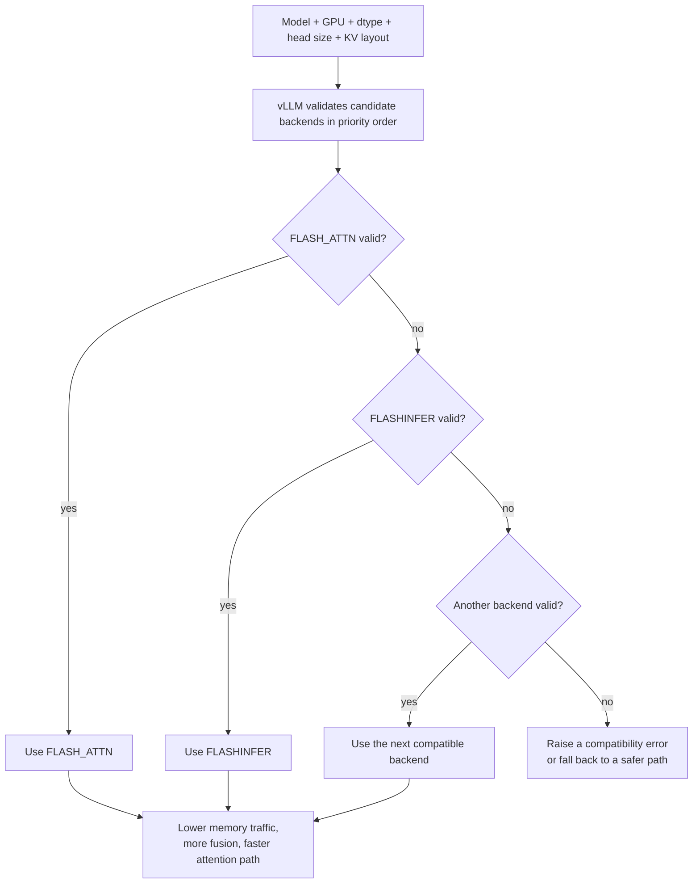

# Optimized CUDA kernels in vLLM

## 1. The short idea

Optimized CUDA kernels are hand-tuned or specialized implementations of expensive model operations such as:

- attention
- GEMM / matrix multiplications
- MoE routing and expert execution

vLLM uses multiple backend families and picks compatible ones based on your hardware and model configuration.

## Concept snapshot

| Lens | Answer |
| --- | --- |
| What | Specialized kernel backends for attention, GEMM, and MoE operations that map model math onto the GPU more efficiently. |
| Why | Inference speed depends not only on the algorithm but on memory movement, fusion, tensor-core usage, and layout compatibility. |
| How | vLLM validates candidate backends against your hardware, dtype, head size, and KV layout, then picks a compatible optimized path. |
| Main knobs | Attention backend selection, dtype/KV dtype, model architecture details, and GPU generation or compute capability. |
| Common confusion | "Optimized kernel" means a better implementation path for the same math, not a different model or different output objective. |
| What it cannot fix alone | An incompatible checkpoint, a memory-starved setup, or a workload bottleneck that lives elsewhere in the stack. |

## Where it sits in the serving path

```text
Model layer -> backend selector validates candidates -> specialized attention/GEMM/MoE kernel runs -> layer output
               ^^^^^^^^^^^^^^^^^^^^^^^^^^^^^^^^^^^^
               optimized kernel selection happens here
```

## 2. Why kernels matter so much

In inference, you do not pay only for “the algorithm.”
You also pay for how efficiently the algorithm is mapped onto the GPU.

Two implementations of the same mathematical attention can differ a lot in real performance because of:

- memory layout
- tensor-core usage
- fusion strategy
- shared-memory use
- block/thread tiling
- specialization for head sizes, dtypes, and KV layouts

## 3. Visual explanation

### Generic unfused path

```text
read Q
read K
compute QK^T
write intermediate
read intermediate
softmax
write intermediate
read intermediate
multiply by V
write output
```

### Optimized fused path

```text
read Q/K/V with layout the kernel likes
compute attention mostly on-chip
avoid extra intermediate writes
write final output once
```

The main win is usually less memory traffic and fewer intermediate tensors.

### Mermaid view: validate backends, then run the best compatible path



The point of this diagram is not the exact universal order for every platform. The point is that vLLM treats kernel choice like a compatibility-and-priority decision, not a one-backend-fits-all rule.

## 4. What vLLM uses today

At a high level, current vLLM docs list optimized attention backends such as:

- FlashAttention
- FlashInfer
- TRTLLM-GEN
- FlashMLA
- Triton-based attention

For GEMM and MoE paths, vLLM also uses optimized kernels or kernel families such as:

- CUTLASS
- TRTLLM-GEN
- CuTeDSL

The important idea is not that you must choose one manually every time.
The important idea is that vLLM has a backend-selection system rather than a single one-size-fits-all kernel.

## What is actually being optimized

| Area | What the optimized path changes | Why you notice it |
| --- | --- | --- |
| Attention | Q/K/V layout access, score computation, softmax, and value aggregation | Sequence-heavy workloads are extremely sensitive to memory traffic here |
| GEMM / MLP | Large matrix multiplications and projection layers | Tensor-core utilization and dtype fit can change throughput a lot |
| MoE | Routing, expert dispatch, and combine steps | Sparse expert movement can become the dominant cost if handled poorly |
| Runtime selection | Which backend family is allowed to run at all | The same model can prefer different kernels on different GPU generations |

## 5. Automatic backend selection

When you do **not** force a backend, vLLM validates candidates in priority order and picks the first compatible one.

A simplified mental model:

```text
hardware + dtype + head size + KV dtype + attention pattern
    -> validate backend A
    -> validate backend B
    -> validate backend C
    -> choose first one that fits
```

That is why “same model, different GPU” can lead to a different best backend.

## 6. Example priority intuition

For standard attention, current docs show that the automatic priority differs by GPU generation.
For example:

```text
Ampere/Hopper standard attention:
1. FLASH_ATTN
2. FLASHINFER
3. TRITON_ATTN
4. FLEX_ATTENTION

Blackwell standard attention:
1. FLASHINFER
2. FLASH_ATTN
3. TRITON_ATTN
4. FLEX_ATTENTION
```

So the “best backend” is not universal.
It is platform-dependent.

## 7. Manual selection when you want control

Sometimes you may want to force a backend to test performance or debug compatibility.

### CLI

```bash
vllm serve meta-llama/Llama-3.1-8B-Instruct   --attention-backend FLASH_ATTN
```

### Structured CLI form

```bash
vllm serve meta-llama/Llama-3.1-8B-Instruct   --attention-config '{"backend": "FLASH_ATTN"}'
```

### Python

```python
from vllm import LLM
from vllm.config import AttentionConfig
from vllm.v1.attention.backends.registry import AttentionBackendEnum

llm = LLM(
    model="Qwen/Qwen3-0.6B",
    attention_config=AttentionConfig(backend=AttentionBackendEnum.FLASH_ATTN),
)
```

## 8. Why manual forcing can fail

A backend must support your exact configuration.
If not, vLLM raises an error explaining why.
That can happen because of:

- compute capability
- unsupported dtype
- unsupported KV dtype
- unsupported head size
- unsupported attention pattern

So manual selection is powerful, but it is not a free override of physics or compatibility.

## 9. Attention kernels vs GEMM/MoE kernels

### Attention kernels
These optimize Q/K/V access, score calculation, softmax, and value aggregation.
They are especially sensitive to sequence structure and KV layout.

### GEMM kernels
These optimize the large matrix multiplications in projections and MLP layers.
They care heavily about dtype and tensor-core mapping.

### MoE kernels
These must handle routing, expert dispatch, and combine steps efficiently.
They are often more complex because they mix communication and compute.

## 10. Worked intuition

Imagine two attention implementations that both produce the same answer.

Implementation A:
- writes big intermediates to global memory
- launches more separate kernels
- uses a generic layout

Implementation B:
- keeps more data on-chip
- fuses more stages
- uses a layout tailored to paged KV cache or the GPU’s tensor-core path

Implementation B is often dramatically faster even though the math is the same.
That is why kernel engineering matters so much in inference systems.

## 11. Practical benchmark workflow

```text
1. Start with automatic backend selection.
2. Measure throughput, TTFT, and ITL.
3. Force one backend at a time only if you have a reason.
4. Compare on the same workload mix.
5. Keep the winning backend only if it is both faster and stable.
```

## 12. Common mistakes

### Mistake: assuming the newest-sounding backend is always best
Best depends on GPU generation, dtype, and model shape.

### Mistake: benchmarking with only one prompt
Kernel trade-offs can change when prompt lengths or batch shapes change.

### Mistake: blaming vLLM generally for a backend-specific mismatch
Sometimes one backend is simply a bad fit for a particular head size or hardware path.

## 13. How this connects to other optimizations

Optimized kernels amplify the value of the rest of the stack:

- **Continuous batching** gives them more useful work.
- **PagedAttention** gives attention kernels a memory layout they can exploit.
- **Quantization** can unlock low-bit kernel paths.
- **CUDA/HIP graphs** can reduce launch overhead around repeated kernel sequences.

## 14. One-line summary

Optimized CUDA kernels make the same model math run much faster by reducing memory traffic, fusing work, and selecting backend implementations that match the GPU and workload.

## 15. Visual references

- vLLM Attention Backend Feature Support: https://docs.vllm.ai/en/stable/design/attention_backends/
- vLLM Optimization and Tuning: https://docs.vllm.ai/en/stable/configuration/optimization/
- vLLM launch blog for the original serving-stack diagrams: https://blog.vllm.ai/2023/06/20/vllm.html

## Source basis
This notebook was written from the official vLLM docs and blog/paper set, including the vLLM docs homepage, Optimization and Tuning, Quantization, Quantized KV Cache, Paged Attention, CUDA Graphs, Attention Backend Feature Support, Batch LLM Inference example, and the original vLLM blog post and paper.
