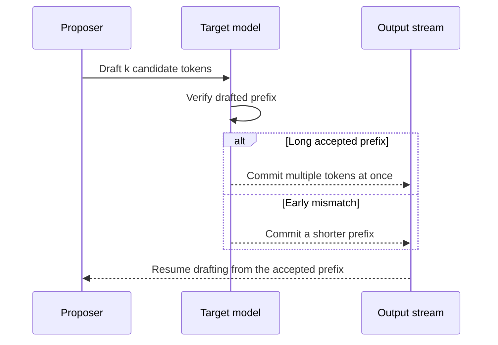

# Speculative decoding in vLLM

## 1. The short idea

Speculative decoding uses a **cheap proposer** to guess several next tokens, then asks the **expensive target model** to verify them.
If the guesses are accepted, the target model effectively moves forward multiple tokens in one go.

This can reduce the number of expensive target-model decode steps.

## Concept snapshot

| Lens | Answer |
| --- | --- |
| What | A draft-and-verify decode strategy where a cheaper proposer suggests several tokens and the target model checks them in batches. |
| Why | One-token-at-a-time target-model decoding is expensive, especially when the target model is memory-bound or latency-sensitive. |
| How | Propose a short token run, verify it with the target model, accept the matching prefix, and continue from the first disagreement. |
| Main knobs | `speculative_config`, proposer choice, `num_speculative_tokens`, and the acceptance behavior of your real prompts. |
| Common confusion | Bigger speculative depth is not automatically better; rejected drafts turn into wasted work if acceptance is poor. |
| What it cannot fix alone | A target model that is already compute-saturated, a proposer that is too expensive, or a workload with weak predictability. |

## Where it sits in the serving path

```text
Prompt/context -> proposer drafts token run -> target model verifies -> accepted prefix commits -> next speculative round
                  ^^^^^^^^^^^^^^^^^^^^^^^^^
                  speculative decoding inserts this extra proposer stage
```

## 2. The core picture

```text
Target model alone:
step 1 -> token 1
step 2 -> token 2
step 3 -> token 3
step 4 -> token 4

Speculative decoding:
drafter proposes [t1, t2, t3, t4]
target verifies
accepted prefix might be [t1, t2, t3]
next round starts from there
```

The speedup comes from reducing how often the full target model must move only one token forward.

## 3. Why this works

A smaller or cheaper proposer is often “good enough” to predict likely next tokens.
The target model remains the final authority.
So you get a draft-and-verify workflow instead of a pure one-token-at-a-time workflow.

## 4. Visual explanation

```text
Round 1
Draft model:   A  B  C  D
Target model:  A  B  C  X
Accepted:      A  B  C
Rejected tail:             D replaced by X-path logic

Net effect:
The target model advanced 3 accepted tokens in one verification round.
```

High acceptance rates usually mean bigger gains.
Low acceptance rates mean more wasted speculative work.

### Mermaid view: proposer and target-model handshake



This is the visual intuition to keep in mind while tuning: the proposer is useful only when the target model can keep accepting long enough prefixes to amortize the extra draft work.

## 5. When it helps most

Current vLLM docs describe speculative decoding as a way to reduce inter-token latency in **medium-to-low QPS, memory-bound workloads**.

A good intuition is:

```text
If the target model is expensive and the proposer is cheap but reasonably accurate,
speculation can help a lot.
```

## 6. vLLM methods at a glance

vLLM supports multiple speculation methods.
A useful mental grouping is:

### Model-based methods
- draft model
- EAGLE
- MTP
- PARD
- MLP speculators

These usually aim for larger gains, but they are more involved.

### Lightweight pattern-based methods
- n-gram speculation
- suffix decoding

These are easier to try because they may not need a separate draft model.

## 7. Draft model example

### Python

```python
from vllm import LLM, SamplingParams

prompts = ["The future of AI is"]
sampling_params = SamplingParams(temperature=0.8, top_p=0.95)

llm = LLM(
    model="Qwen/Qwen3-8B",
    tensor_parallel_size=1,
    speculative_config={
        "model": "Qwen/Qwen3-0.6B",
        "num_speculative_tokens": 5,
        "method": "draft_model",
    },
)

outputs = llm.generate(prompts, sampling_params)
print(outputs[0].outputs[0].text)
```

### CLI

```bash
vllm serve Qwen/Qwen3-4B-Thinking-2507   --host 0.0.0.0   --port 8000   --seed 42   -tp 1   --max-model-len 2048   --gpu-memory-utilization 0.8   --speculative_config '{"model": "Qwen/Qwen3-0.6B", "num_speculative_tokens": 5, "method": "draft_model"}'
```

## 8. Lightweight alternative: n-gram speculation

This method tries to propose tokens by matching repeated n-grams in the prompt.
It is simpler and does not require an extra draft model.

```python
from vllm import LLM, SamplingParams

llm = LLM(
    model="Qwen/Qwen3-8B",
    tensor_parallel_size=1,
    speculative_config={
        "method": "ngram",
        "num_speculative_tokens": 5,
        "prompt_lookup_max": 4,
    },
)
```

## 9. Another lightweight option: suffix decoding

Suffix decoding also avoids a separate draft model, but it can match against both the prompt and previous generations and adapt its speculation depth dynamically.
That makes it attractive for highly repetitive tasks such as code editing or agent loops.

```python
from vllm import LLM, SamplingParams

llm = LLM(
    model="Qwen/Qwen3-8B",
    tensor_parallel_size=1,
    speculative_config={
        "method": "suffix",
        "num_speculative_tokens": 32,
    },
)
```

## 10. EAGLE and MTP intuition

### EAGLE
Uses a learned speculative model family tuned for strong proposer quality.
Often a strong general-purpose choice when compatible draft models are available.

### MTP (multi-token prediction)
Uses a target model family with native multi-token prediction support.
This removes the need for a separate draft model in the usual sense.

## 11. Why acceptance rate matters

The real objective is not “propose many tokens.”
The real objective is “propose many **correctly acceptable** tokens.”

```text
High speculative depth + low acceptance  = wasted draft work
Moderate depth + high acceptance         = good speedup
```

So `num_speculative_tokens` is not something you should max out blindly.

## Acceptance-rate intuition table

| Acceptance pattern | What it feels like | Likely outcome | What to do next |
| --- | --- | --- | --- |
| High | The draft model keeps guessing the same next tokens the target would choose | Strong latency gain because several target steps collapse into one verification round | Try a slightly deeper speculation depth and confirm quality stays stable |
| Mixed | Some rounds jump ahead, some rounds mostly fall back | Moderate gain with noticeable workload dependence | Tune proposer choice and speculative depth on representative prompts |
| Low | The target rejects a lot of drafted tokens | Draft work becomes overhead and speedup disappears | Use a cheaper or better-matched proposer, or disable speculation for that workload |

## 12. Accuracy and losslessness intuition

Current vLLM docs frame speculative decoding as theoretically and algorithmically lossless up to hardware numerical precision limits, while also noting that logprobs are not guaranteed to be stable across runs.

In plain language:

- token generation should follow the target model’s intended distribution
- tiny floating-point differences can still affect exact run-to-run behavior
- logprob exactness is not the guarantee you should expect here

## 13. When it helps less

Speculation may help less when:

- QPS is very high and the draft workload becomes harder to amortize
- the proposer is not much cheaper than the target
- acceptance rate is poor
- your target model or pipeline setup is not compatible with the chosen method

## 14. Practical tuning checklist

```text
1. Start with a modest num_speculative_tokens.
2. Measure TTFT, ITL, throughput, and acceptance rate together.
3. Try a lightweight method first if you want a quick experiment.
4. Move to draft-model or EAGLE approaches if you want stronger gains.
5. Keep a plain non-speculative baseline for sanity checks.
```

## 15. Common mistakes

### Mistake: choosing the strongest proposer by size, not by efficiency
The proposer must be cheap enough to justify itself.

### Mistake: optimizing only for low-QPS latency without checking high-QPS behavior
Some methods behave differently when traffic rises.

### Mistake: increasing speculative depth without checking acceptance
A bigger draft is not always a better draft.

## 16. One-line summary

Speculative decoding speeds up generation by letting a cheaper proposer guess several next tokens and having the target model verify them, so the expensive model can advance more than one token per verification round when guesses are accepted.

## 17. Visual references

- vLLM speculative decoding guide: https://docs.vllm.ai/en/stable/features/speculative_decoding/
- vLLM speculative decoding blog with performance and acceptance-rate visuals: https://blog.vllm.ai/2024/10/17/spec-decode.html
- Speculative sampling paper: https://arxiv.org/abs/2302.01318

## Source basis
This notebook was written from the official vLLM docs and blog/paper set, including the vLLM docs homepage, Optimization and Tuning, Quantization, Quantized KV Cache, Paged Attention, CUDA Graphs, Attention Backend Feature Support, Batch LLM Inference example, and the original vLLM blog post and paper.
