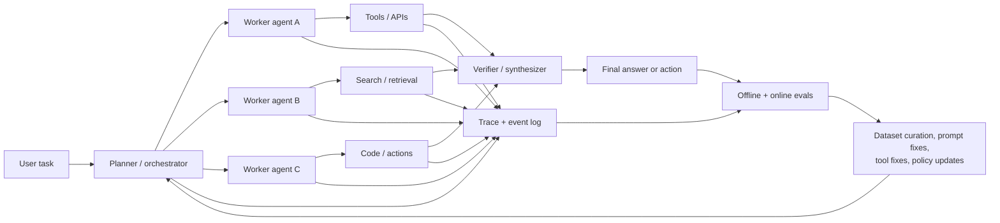
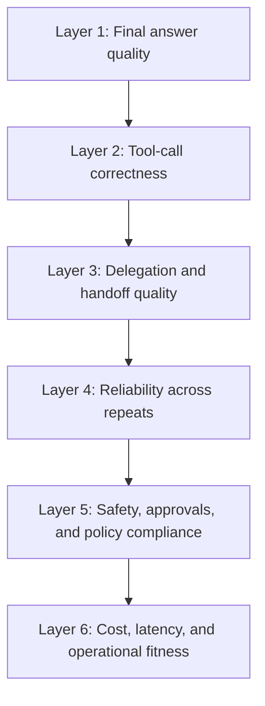
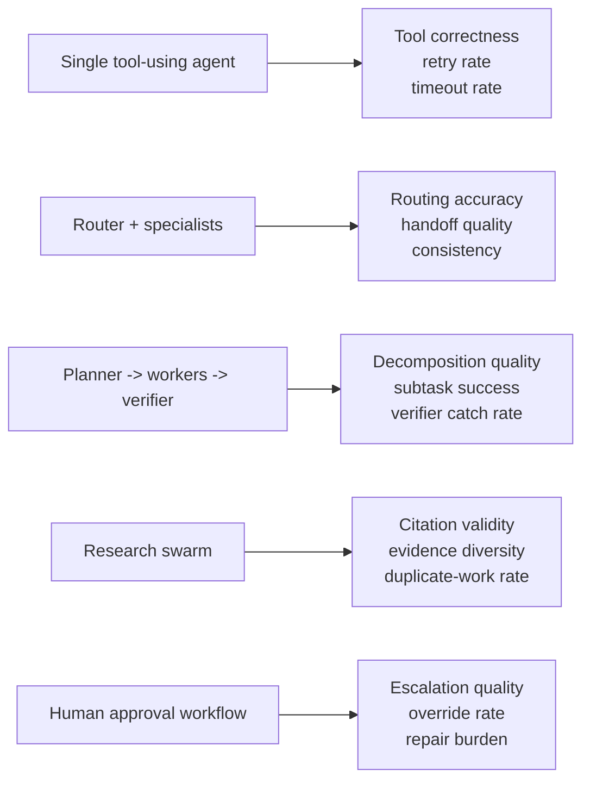

# Agentic multi-agent system evaluation

## 1. The short idea

Evaluating an agentic multi-agent system is not only about whether the final answer looks good.
You also need to evaluate:

- whether the right agent took the right role
- whether tool calls were correct and safe
- whether handoffs and coordination were efficient
- whether the system stayed within latency and cost budgets
- whether humans were involved at the right checkpoints

That is the core shift:

```text
Single-call LLM evaluation        -> "Was the answer good?"
Agentic system evaluation         -> "Was the outcome good, and was the path reliable?"
```

## Concept snapshot

| Lens | Answer |
| --- | --- |
| What | A layered evaluation approach for systems where multiple agents plan, delegate, call tools, exchange messages, and sometimes escalate to humans. |
| Why | Final-answer scoring alone hides many production failures: bad routing, useless delegation, wrong tool arguments, unsafe actions, retry loops, and silent cost blowups. |
| How | Combine offline datasets, trajectory-level scoring, tool and handoff checks, online monitoring, and human review into one continuous feedback loop. |
| Main knobs | Dataset slices, task-success criteria, judge rubrics, trace instrumentation, retry/timeout limits, approval gates, and cost-latency budgets. |
| Common confusion | A multi-agent system is not automatically better than a simpler workflow; it earns its complexity only if evals show real gains. |
| What it cannot fix alone | Weak task definitions, missing ground truth, bad tools, or a production process with no tracing and no feedback loop. |

## Where it sits in the agent loop

```text
User task
   -> planner / router
   -> worker agents
   -> tools / APIs / memory / external systems
   -> final answer or action
   -> traces, logs, metrics, human feedback
   -> eval pipeline
   -> prompt / policy / tool / architecture updates
```

## 2. Why this is harder than evaluating a single LLM call

A multi-agent system creates more failure surfaces than a single prompt-response application.
One request may involve:

- a planner deciding whether the task should be decomposed
- one or more specialist agents handling subtasks
- tool use, web search, retrieval, or code execution
- a synthesizer or verifier combining partial results
- a human approval step before a risky action

This means one request can fail in many different ways:

- the planner decomposes the work badly
- the wrong specialist gets the task
- a tool is called with invalid arguments
- agents repeat work because context sharing is poor
- an answer looks plausible even though the supporting path was broken

That is why mature evaluation has to score both:

1. **Outcome quality**
2. **Process quality**

## 3. Visual explanation

### One-request view

```text
User request
   |
   v
[Orchestrator]
   | \
   |  \--> [Worker A] --> [Tool/API]
   |  \--> [Worker B] --> [Retriever/Search]
   |  \--> [Worker C] --> [Code / DB / Action]
   |
   v
[Verifier / Synthesizer]
   |
   v
Final answer or action

Evaluation must inspect:
- final output
- delegation path
- tool usage
- retries / loops
- latency / cost
- human approvals
```

### Mermaid view: end-to-end evaluation loop



### Mermaid view: the evaluation ladder



The practical lesson is simple:
if you only score layer 1, you can ship a system that "looks smart" while still being fragile, expensive, and unsafe.

## 4. What to evaluate at each layer

| Layer | What to score | Example signals |
| --- | --- | --- |
| Final outcome | Did the system solve the user task? | exact match, rubric score, groundedness, factuality, structured-output validity |
| Trajectory | Did it take a sensible path? | unnecessary loops, dead-end branches, redundant delegation, missing verification steps |
| Tool use | Did agents call the right tool with the right arguments? | tool precision/recall, argument validity, API error rate, state diff correctness |
| Coordination | Did the right agent do the right work? | handoff correctness, planner quality, overlap rate, cross-agent consistency |
| Human interaction | Did the system involve a person at the right time? | escalation quality, approval rate, override rate, correction rate |
| System operations | Is the system production-viable? | latency, token cost, retries, timeout rate, queue depth, pass rate under load |

## 5. Recent blogs and case studies worth reading

### Anthropic: building effective agents

Anthropic's late-2024 production guidance is useful because it separates **workflows** from **agents**, recommends starting with the simplest pattern that works, and describes common patterns such as prompt chaining, routing, parallelization, orchestrator-workers, and evaluator-optimizer loops.
For this topic, the most important lesson is that multi-agent complexity should be earned through measurement, not assumed up front.

### Exa: research multi-agent system in production

Exa's 2025 case study is a strong example of a research-oriented multi-agent system in production.
Their architecture uses a planner, parallel research tasks, and an observer that preserves full context while individual tasks receive only the cleaned context they need.
This is a good case study for trajectory evaluation because the system's quality depends on both final structured output and task decomposition quality.

### Replit: user-in-the-loop coding agent

Replit's case study is useful because it shows why multi-agent systems often become **less** autonomous, not more.
Their manager/editor/verifier split emphasizes reliability, reversibility, and keeping the user engaged in the loop.
This is exactly the kind of system where evaluation has to score not just autonomous success, but also user interruption quality, verification quality, and correction flow.

### Google A2A: interoperability becomes a system requirement

Google's A2A announcement matters because it frames multi-agent evaluation as more than one framework's internal problem.
If agents from different frameworks or vendors collaborate, you also need to evaluate capability discovery, task lifecycle handling, artifacts, and protocol-level interoperability.

### Direct reading list

- Anthropic, *Building effective agents*: https://www.anthropic.com/engineering/building-effective-agents
- Exa case study, *How Exa built a Web Research Multi-Agent System with LangGraph and LangSmith*: https://www.langchain.com/blog/exa
- Replit case study, *Replit Agent*: https://www.langchain.com/breakoutagents/replit
- Google Developers Blog, *Announcing the Agent2Agent Protocol (A2A)*: https://developers.googleblog.com/en/a2a-a-new-era-of-agent-interoperability/
- OpenAI, *Evaluation best practices*: https://developers.openai.com/api/docs/guides/evaluation-best-practices

## 6. An end-to-end evaluation framework

This is the framework I would recommend for most teams building an agentic system.

### Step 1: define the business outcome first

Start with one sentence:

```text
For task type X, the system is successful only if Y happens within Z cost/latency limits.
```

Examples:

- research agent: correct structured memo with citations in under 3 minutes
- support agent: case resolved or escalated correctly without violating refund policy
- coding agent: patch passes tests and is acceptable for review with bounded retries

If this success definition is vague, all later evaluation will drift.

### Step 2: define the unit of evaluation

For multi-agent systems, the "thing" you score may be:

- a final answer
- one complete run
- one planner decision
- one handoff
- one tool call
- one conversation thread

Use multiple units.
If you only score whole-run success, you will miss which component is failing.

### Step 3: build a layered dataset

A strong dataset has more than prompts.
For each example, store as much of the following as you can:

- user objective
- task type and slice tags
- expected outcome or acceptance criteria
- risky tools or policies involved
- whether human approval should be required
- expected final state if the task modifies a system

Useful slice tags include:

- easy / medium / hard
- long-horizon
- multi-tool
- policy-sensitive
- ambiguous user request
- partial-information setting

### Step 4: instrument the full trace

Without traces, multi-agent evaluation collapses into guesswork.
Capture:

- agent messages
- planner outputs
- tool names and arguments
- tool results and errors
- retries, stops, and timeouts
- final answer
- latency and token usage by stage
- human approvals, rejections, or edits

This is the minimum data you need to score trajectory quality later.

### Step 5: design graders for different failure modes

A healthy evaluator set mixes:

- deterministic code checks
- reference-based scoring
- LLM-as-judge rubrics
- pairwise comparisons
- human review for high-value or high-risk slices

Do not force one evaluator type to do everything.

### Step 6: run offline evaluations before deployment

Offline evals answer questions like:

- Is the new planner better than the old planner?
- Did adding another worker improve outcomes or only add cost?
- Did the verifier reduce hallucinations or just slow the system down?
- Did a new tool help difficult tasks while hurting easy ones?

This is where curated datasets and scenario slices are most valuable.

### Step 7: run adversarial and reliability tests

After the happy-path dataset, test:

- repeated runs on the same task
- malformed tool outputs
- ambiguous user instructions
- partial failures from one worker or one tool
- long-running tasks that require stop conditions
- conflicting sub-agent recommendations

For agentic systems, reliability under perturbation matters as much as average score.

### Step 8: launch with online monitoring

Once in production, move from "did it pass the benchmark?" to:

- what is failing now?
- which slice is degrading?
- is the failure rate changing after traffic changes?
- which bad traces should become new offline examples?

This is where online evaluators, alerts, trace sampling, and annotation queues matter.

### Step 9: close the loop with human review

Human review should not be an afterthought.
Use it to:

- validate or calibrate LLM-as-judge metrics
- inspect costly or risky failures
- promote bad traces into gold data
- refine approval policies
- decide whether complexity should be reduced

## 7. Metrics and grading techniques that actually work

### Outcome metrics

Use these when the system's job is primarily to produce an answer or artifact:

- exact match
- pass/fail against structured criteria
- semantic similarity to reference
- rubric-based LLM judge score
- citation validity or evidence coverage

### Trajectory metrics

Use these when the path matters:

- number of handoffs
- redundant handoffs
- useless branches
- retry count
- planner decomposition quality
- verifier catch rate

A common pattern is to grade one whole trace and then attach sub-scores to critical steps.

### Tool-use metrics

Tool-heavy agents should be scored on:

- tool selection correctness
- argument correctness
- rate of recoverable vs unrecoverable tool failures
- final environment state correctness
- whether a dangerous tool should have required approval

For action-oriented systems, state change is often the most reliable ground truth.

### Reliability metrics

For multi-agent systems, run the same task repeatedly.
Track:

- pass rate across repeats
- variance in latency and cost
- loop frequency
- timeout rate
- success under tool noise or partial failure

Benchmarks like tau-bench are especially useful here because they emphasize consistency and rule-following rather than only one-shot brilliance.

### Human-centered metrics

Some of the best production signals are:

- how often humans override the system
- how often they approve on first pass
- whether escalation happened too late or too early
- how much repair work the user had to do after the agent acted

These metrics matter most when the system is semi-autonomous rather than fully autonomous.

### Choose metrics based on agent architecture

One of the most common mistakes is using the same scorecard for every agent system.
The architecture should shape the metric stack.

| Agent architecture | What usually breaks first | Metrics to prioritize |
| --- | --- | --- |
| Single agent with many tools | Wrong tool choice, bad arguments, looping retries | tool selection correctness, argument validity, recoverable error rate, retry count, timeout rate |
| Router plus specialist agents | Wrong routing, duplicate work, inconsistent specialist outputs | routing accuracy, handoff correctness, overlap rate, cross-agent consistency, cost per successful run |
| Planner -> worker -> verifier | Bad decomposition or weak verification | planner decomposition quality, subtask completion rate, verifier catch rate, false-reject rate, rework cost |
| Research team with parallel web agents | Repeated evidence, shallow evidence, unsupported claims | citation validity, evidence diversity, unsupported-claim rate, duplicate-search rate, synthesis quality |
| Coding agents | Wrong edits, unverified patches, unstable retries | tests passed, patch acceptance rate, retry count, diff quality, sandbox/policy violations |
| Human-in-the-loop agent | Poor escalation timing, too much user repair work | escalation precision/recall, override rate, approval necessity, time-to-approval, user repair burden |

### Mermaid view: architecture drives metric choice



The right question is not "what metrics are best in general?"
It is "which metrics expose the failure mode that this architecture is most likely to create?"

## 8. Frameworks, protocols, and stack options

The ecosystem is easier to understand if you separate it by role.

| Layer | What it is for | Common options |
| --- | --- | --- |
| Orchestration framework | Build the multi-agent workflow itself | LangGraph, AutoGen AgentChat, CrewAI |
| Evaluation and observability | Trace, score, compare, monitor, review | OpenAI Evals, LangSmith, Phoenix, Inspect |
| Interoperability protocol | Connect tools or remote agents across systems | MCP, A2A |
| Benchmarks | Stress-test agent behavior on public tasks | AgentBench, GAIA, tau-bench, SWE-bench Verified |

### Orchestration frameworks

**LangGraph** is strong when you want a lower-level, controllable agent runtime with persistence, long-running workflows, and human-in-the-loop support.

**AutoGen AgentChat** is strong when you want explicit teams, selectors, group chat patterns, and customizable agent behaviors.

**CrewAI** is useful when you want role-based crews plus event-driven flows to manage stateful automation.

### Evaluation and observability stacks

**OpenAI Evals** is helpful when you want explicit eval objects, test criteria, and repeatable runs around model behavior.

**LangSmith** is strong for offline + online evaluation, agent traces, human review, pairwise comparison, and production feedback loops.

**Phoenix** is strong for OpenTelemetry-based tracing plus evals, experiments, and rich evaluator instrumentation.

**Inspect** is strong when you want open, reproducible evaluation tasks with built-in support for agents, tools, multi-agent architectures, and even human baselines.

### Mainly open-source evaluation frameworks

If you want a mostly open-source stack, these are the first tools I would evaluate:

| Framework | Main role | How teams typically use it | Best fit |
| --- | --- | --- | --- |
| Inspect AI | Agent-task eval harness | define tasks, run agents with tools, compare architectures, keep transcripts, add human baselines | benchmark-style evaluation of agentic and multi-agent tasks |
| Phoenix OSS | Tracing + eval + experiments | collect production traces, run LLM or code-based evaluators, compare prompt/model changes on datasets | trace-first debugging and regression testing |
| Langfuse | Self-hostable observability + datasets + evals | turn traces into datasets, run experiments, add live evaluators, monitor agent graphs and sessions | production iteration with self-hosting and collaboration |
| DeepEval | Test framework for LLM systems | write CI tests with metrics, bulk-evaluate datasets, score components like agents or tools, gate regressions in PRs | developer-first regression testing |
| OpenAI `simple-evals` | Lightweight reference eval library | prototype small eval runs and study reference implementations for benchmark-style grading | simple offline eval scripts and reference baselines |

### How these frameworks are being used in practice

There are four common usage patterns:

1. **CI regression suite**
Use DeepEval or a lightweight eval harness to fail builds when key slices regress.
This is strongest for deterministic tasks, tool-use tasks, and prompt or policy changes.

2. **Trace-first debugging**
Use Phoenix or Langfuse to capture the exact planner, tool, and agent path that produced a failure.
This is strongest when the architecture is already in production and you need to understand why a run failed, not just whether it failed.

3. **Architecture bake-offs**
Use Inspect or a benchmark harness to compare:
- one agent vs multi-agent
- tool call vs handoff
- planner-worker vs sequential workflow
- with-verifier vs without-verifier

4. **Online monitoring and dataset growth**
Use Phoenix, Langfuse, or a managed stack to turn bad traces into new dataset items and keep testing new iterations against real production failures.

### Open-source framework notes

**Inspect AI**
Best when the evaluation itself is the product of interest.
It is designed around evaluations, supports agents, tools, custom agents, multi-agent compositions, and even a human agent for baselining. That makes it especially useful for architecture comparison and research-style benchmarking.

**Phoenix OSS**
Best when you need trace-centric evaluation.
A common pattern is: instrument the system with OpenTelemetry, inspect failing traces, attach evaluators to traces or datasets, then rerun experiments after prompt or tool changes.

**Langfuse**
Best when you want a self-hostable workflow that ties together traces, sessions, agent graphs, datasets, experiments, and live evaluators.
Teams often use it as the central system of record for prompt iterations and regression testing across real traces.

**DeepEval**
Best when developers want evaluation to feel like testing.
It fits well into CI, supports end-to-end and component-level evaluation, and is especially practical when teams want regression checks for agents, tool-calling, or conversational behavior in normal engineering workflows.

**OpenAI `simple-evals`**
Best as a reference or a minimal starting point rather than a full agent observability platform.
It is useful for small offline evaluation loops and transparent benchmark-style experiments, but it is not the full stack most teams use for production agent systems.

### Direct framework docs

- Inspect AI docs: https://inspect.aisi.org.uk/
- Inspect multi-agent guide: https://inspect.aisi.org.uk/multi-agent.html
- Phoenix docs: https://arize.com/docs/phoenix/
- Langfuse overview: https://langfuse.com/docs
- Langfuse evaluation overview: https://langfuse.com/docs/evaluation/overview
- DeepEval repository and docs entry point: https://github.com/confident-ai/deepeval
- OpenAI `simple-evals`: https://github.com/openai/simple-evals

### Protocols and system glue

**MCP** standardizes how applications expose tools, data sources, and workflows to models and agents.

**A2A** standardizes how one agent communicates tasks, status, artifacts, and capabilities to another agent.

The easiest way to think about them is:

```text
MCP = how an agent talks to tools and context
A2A = how an agent talks to another agent
```

## 9. Benchmark suites worth knowing

### AgentBench

Use this when you want a broad benchmark for autonomous-agent behavior across multiple interactive environments.
It is useful for comparing model or architecture families at a high level.

### GAIA

Use this when you care about general assistants that need reasoning, tool use, browsing, and multimodal handling on realistic tasks.
It is especially useful for research and deep-research style systems.

### tau-bench

Use this when you care about rule-following, multi-turn user interaction, and reliability in tool-using agents.
Its `pass^k` framing is especially useful for thinking about consistency across repeated runs, not just single-run success.

### SWE-bench Verified

Use this when evaluating coding agents on real GitHub issues and test-verifiable patches.
It is the clearest benchmark fit when your agent edits code and can be checked by automated tests.

## 10. Minimal evaluation harness example

The exact framework can vary, but the structure tends to look like this:

```python
evaluation_record = {
    "task_id": "research-042",
    "input": "Find three SOC2-compliant vendors and summarize trade-offs.",
    "tags": ["research", "multi-agent", "policy-sensitive"],
    "expected": {
        "must_include": ["3 vendors", "citations", "trade-offs"],
        "approval_required_before_action": True,
    },
    "trace": {
        "planner_steps": [...],
        "handoffs": [...],
        "tool_calls": [...],
        "final_output": "...",
        "latency_seconds": 54.2,
        "token_cost_usd": 0.83,
    },
    "graders": {
        "final_answer_rubric": "...",
        "citation_check": "...",
        "handoff_quality": "...",
        "tool_arg_validity": "...",
        "cost_budget_check": "...",
    },
}
```

The deeper lesson is that a good record stores both the **artifact** and the **path**.

## 11. Worked example: evaluating a research-and-action agent team

Imagine a system with:

- one planner
- two researcher agents
- one verifier
- one action agent that can draft outreach or create tickets

### What success looks like

The system should:

1. gather the right facts
2. cite them
3. separate uncertain claims from confirmed claims
4. avoid duplicate research
5. ask for human approval before external action

### What to score

**Final output**

- Is the summary correct?
- Are citations attached?
- Is uncertainty stated clearly?

**Planner quality**

- Did the planner split the task sensibly?
- Did it create too many subtasks?

**Research quality**

- Did researchers gather distinct evidence?
- Did they over-search and waste cost?

**Verifier quality**

- Did the verifier catch unsupported claims?
- Did it reject low-confidence results?

**Action safety**

- Did the action agent wait for approval?
- Was the draft based only on verified evidence?

This is a good example of why one scalar score is never enough.
The same run can have:

- a correct final answer but terrible efficiency
- a strong research phase but unsafe action behavior
- a smart planner but weak verifier

## 12. Human review and production monitoring

Offline evals tell you whether a design is promising.
Production monitoring tells you whether it stays healthy.

A practical online loop looks like this:

1. Trace every run.
2. Sample runs by slice and by risk level.
3. Run lightweight online evaluators on all traffic.
4. Route suspicious traces to human review.
5. Promote bad traces into the offline benchmark set.
6. Re-test before changing prompts, tools, or architecture.

This is the point where many teams discover that observability and evaluation are really one system, not two separate concerns.

## 13. Practical tuning checklist

```text
1. Start with the smallest architecture that can plausibly solve the task.
2. Define success in business terms before writing graders.
3. Trace planner decisions, handoffs, tool calls, and approvals.
4. Mix deterministic checks, judge models, and human review.
5. Evaluate both final outcomes and trajectories.
6. Repeat tasks multiple times to test reliability, not just average quality.
7. Slice results by task type, risk, tool use, and horizon length.
8. Feed bad production traces back into offline datasets.
9. Remove complexity if a simpler workflow matches the score.
```

## 14. Common mistakes

### Mistake: evaluating only the final answer
A system can produce a good-looking result through an unsafe, expensive, or lucky path.

### Mistake: treating more agents as automatic progress
Extra agents often add latency, coordination overhead, and new failure modes.

### Mistake: skipping trace instrumentation
If you cannot inspect the path, you cannot debug the architecture.

### Mistake: using only one judge model and trusting it blindly
Judge prompts drift too. They need calibration against human review.

### Mistake: ignoring variance across repeated runs
An agent that succeeds once but fails unpredictably is not production-ready.

### Mistake: forgetting the human workflow
Semi-autonomous systems should be evaluated on approval quality, correction burden, and escalation timing.

## 15. One-line summary

Evaluating a multi-agent system means measuring not just whether it reached the right answer, but whether planning, delegation, tool use, safety, reliability, and human interaction all worked together in a production-worthy way.

## 16. Visual references

- Anthropic, *Building effective agents*: https://www.anthropic.com/engineering/building-effective-agents
- OpenAI, *Evaluation best practices*: https://developers.openai.com/api/docs/guides/evaluation-best-practices
- OpenAI Evals use case, *Tools evaluation*: https://developers.openai.com/cookbook/examples/evaluation/use-cases/tools-evaluation
- LangSmith evaluation concepts: https://docs.langchain.com/langsmith/evaluation-concepts
- Arize Phoenix evaluation docs: https://arize.com/docs/phoenix/evaluation/llm-evals
- Google, *Announcing the Agent2Agent Protocol (A2A)*: https://developers.googleblog.com/en/a2a-a-new-era-of-agent-interoperability/

## Source basis
This notebook was written from recent official blogs, docs, and benchmark pages covering agent design, evaluation, observability, interoperability, and public benchmarks, including Anthropic's *Building effective agents*, OpenAI's eval guides, LangSmith evaluation docs, Arize Phoenix eval and tracing docs, Google A2A, Model Context Protocol docs, AutoGen docs, CrewAI docs, LangGraph docs and case studies, Inspect docs, AgentBench, GAIA, tau-bench, and SWE-bench.
